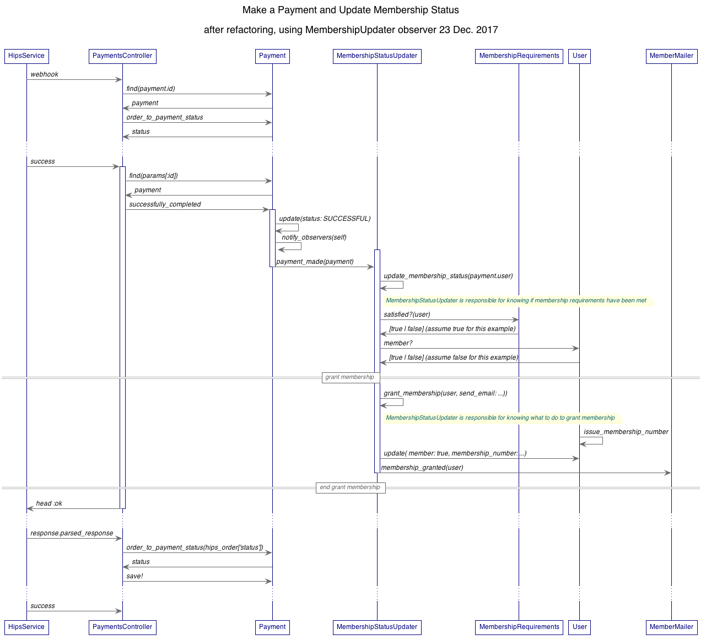

# Refactoring managing membership status to use the Observer Pattern

## Goals:

#### SOLID OO Design Principles
- Single Responsibility _Each class should have a single responsbility.  coding strategy_
- Open/Closed principle _"Open" to extension (changing business requirements) but "closed" to modification (requiring lots of modifications to make that happen) a goal_
- Liskov substitution _Objects can be replaced with subclasses without affectingn the correctness of a program. abstract formula about software_
- Interface segregation _Many different interfaces are better than a few large ones (break things down into small things)_
- Dependency inversion _Be dependent on abstractions, not concretions (depend on the larger contract/responsibility, not the actual classes that might implement it) coding strategy, especially important for static languages (not Ruby)_

These are all strategies you can apply so that when change happens (and it will), you can 
reduce all the dependencies and entaglements within your code.

Another way to express these are with the more classic Software Engineering principles:
#### Software Engineering principles
- loose coupling  _things are not dependent on each other_
- high cohesion _the purpose of a component (class) should be focused and cohesive; it should have one clear, focused responsibility_
- context independent _objects are complete and independent without having to depend on lots of other objects being in specific states_
- easily composable _many, small components can be easily put together to accompish goals without having to change code_

[Robert Martin: SOLID, Agile Manifesto, 'clean' coding and architecture](https://en.wikipedia.org/wiki/Robert_C._Martin)

[Wikipedia: SOLID object oriented design](https://en.wikipedia.org/wiki/SOLID_(object-oriented_design))

[Sandi Metz: SOLID Object-Oriented Design presentation at GORUCO 2009:](https://youtu.be/v-2yFMzxqwU)  
An excellent introductory video on SOLID principles and how to put them into practice.

#### Skinny Controllers  (Rails specific)
 - Controllers should be responsbile displaying the right views based on models and actions, _not_ business logic

  Reference:  Advi Grimm: Slim down hefty Rails controllers AND models, using domain model events
  https://www.rubytapas.com/2017/04/11/skinny-controller-domain-model-events/
 
 ---

#Current state
We've learned a lot about the domain since we started implementing all of this.  And we've certainly developed a lot of code.
Now it's time to take what we've learned and think about how to refactor so that we are doing good, SOLID OO design.

The main function of the system is to **manage membership status.**  It is to _make sure that 
the membership status for every `User` in the system is always correct, based on the business rules for SHF._ 

Currently, the responsbility for knowing if the membership status should be granted is spread out between multiple classes:  **`PaymentsController`** and **`User`.**
This also means that the `PaymentsController` is responsible for an important piece of business domain logic in addition to responding to actions and displaying the right views.
The controller should not be responsible for this; it should not have to know or care about who should or should not have membership granted. 

When we need to respond to changing business requirments (not "if," but _when_), we should have one place (interface or class) where we make changes. (This is what being _agile_ is all about.)
The rest of the system should not have to be modified (**Open/Closed principle**).

In order to accomplish this, we need to have minimal coupling ( = minimal dependency). 

This is easy to accomplish by setting up one class that is responsible for knowing if membership should be granted. It's easy to reduce coupling by having this class _observe_ the state of domain objects and respond appropriately.
This is a fundamental and common pattern in software and easy to implement in Ruby with the standard library **Observable** module.

 
Here's a sequence diagram that shows how we currently determine if a membership should be granted and how the membership is granted.
This incorporates the changes in [PR 441: Do not grant membership for branding payment](https://github.com/AgileVentures/shf-project/pull/441)  that moves the logic into the success method of the `PaymentsController`.

Note that **both** the `PaymentsController` and `User` are  responsible for granting membership.
If the business rules change, both the `PaymentsController` class and the `User` class must be modified.

`PaymentsController` has to interact with many different domain objects. It is _highly coupled_ to many different classes.  
That means there are many dependencies (entanglements).
It should not be responsible for implementing business logic.

Additionally, the `User` class has many, many responsibilities.  Among them, the `User` class:
  - must determine the next membership number that should be used in the system
  - must calculate the end of the current membership term, which depends on knowing the specific type of payment
  - must know that mail should be sent out when membership is granted, and which email to send
  - if a membership term has expired or not, which depends on knowing the specific type of payment 
  - if a membership payment can be made
  - when the next membership payment is due, which depends on knowing about the type of payment that a 'membership fee' is
  
The `User` class clearly does not have a single responsbility.  We need to refactor it and put those responsibilities elsewhere.
A `User` class should _respond_ and perhaps change its internal state based on essages it receives from other things in the system.  It should not be responsible for making those things happen _and_ responding to them.

## Refactoring to be more SOLID
- Create a class that has the single responsibility of knowing if a `User` meets the all of the 
requirements for being a member: **`MembershipRequirements`**
- Create a class that has the single responsibility of doing what needs 
to be done when membership is granted: **`MembershipStatusUpdater`**  (In my code, I have also included the responsibility for revoking membership.  It could easily be argued that this should be in a separate class.)
- remove those responsiblities from the `User` and `PaymentsController` classes
- Use the Observer pattern to reduce dependencies (coupling) between those classes when membership is granted.

Here's the sequence diagram

  

The sequence diagram makes it clear that the `PaymentsControler`  now does much less.
 When the payment has been made successfully, the `PaymentsControler` now just makes sure that the `payment` sends the `successfully_made` message.  
 The `PaymentsControler` does not need to know (is not dependent on)  what that means or what other objects/classes that might invovle.
 
 
 It's also clear that checking for and granting membership is now encapsulated in the 2 classes.  
 The responsbilities are now well encapsulated; they are not entangled in many different classes and interactions (dependencies).
 

### Disclaimers about the code:
There is surely clean up and further refactoring that can be done.  I did write specifications and tests, but did not double-check to ensure that I have covered all possibilities or needed scenarios.
It took me longer to write this up than it did to write the code, which is a testement to the power of the Observer pattern.

